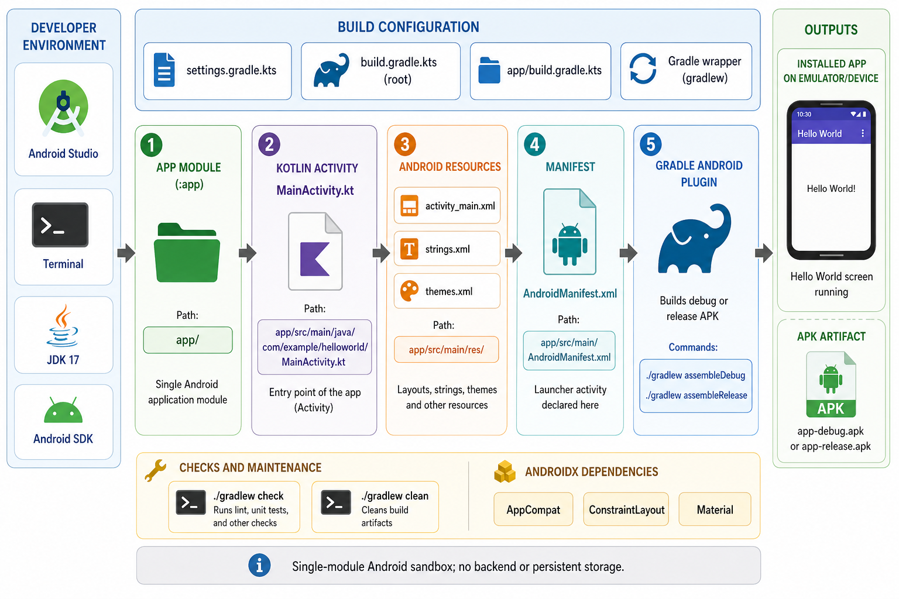

<div align="center">
  

  **🤖 Minimal Android sandbox for experimenting with Kotlin and Gradle builds 📱**
</div>

sandbox-android is a small Kotlin Android app for testing Android project setup, Gradle builds, and basic UI changes without extra application complexity.

It builds a single `:app` module that launches a `Hello World` screen through `MainActivity`.

## Install

```bash
git clone https://github.com/tsilva/sandbox-android.git
cd sandbox-android
./gradlew assembleDebug
./gradlew installDebug
```

Open the installed `Hello World` app on a connected emulator or Android device.

## Commands

```bash
./gradlew assembleDebug     # build a debug APK
./gradlew assembleRelease   # build a release APK
./gradlew installDebug      # install the debug app on a connected device
./gradlew check             # run Gradle checks
./gradlew clean             # remove build outputs
```

## Notes

- Requires JDK 17 and an Android SDK installation.
- Uses Gradle 8.2 through the wrapper, Android Gradle Plugin 8.1.0, and Kotlin 1.9.0.
- Compiles against Android SDK 34 with min SDK 24 and target SDK 34.
- The app uses AndroidX AppCompat, ConstraintLayout, Material Components, and a simple XML layout.
- This is a single-module Android sandbox with no backend service or persistent storage.

## Architecture



## License

[MIT](LICENSE)
